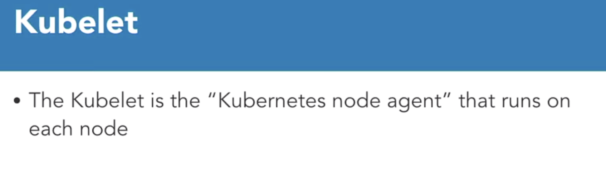

# Kubelet and Kubeproxy
We had talked about kubelet and kube-proxy components when we discussed the overall architecture earlier. Let's dig into these a bit.
## Kubelete

> The kubelet is the Kubernetes node agent that runs on each node.

It has many roles.
1. It communicates with the API server to see if pods have been assigned to the nodes. 
2. It executes the pod containers via the container engine. 
3. It mounts and runs pod volumes and secrets. 
4. It executes health checks and is aware of pod and node status and reports that back to the API server.
### Kubelet and Podspec
1. The kubelet works in terms of Podspec, which is just a YAML file that describes the pod.
2. The kubelet takes a set of Podspecs that are provided by the kube-apiserver and ensures that the containers described in those Podscpecs are running and healthy. 
3. It's important to note that the kubelet only manages containers that were created by the API server, and not any other 
containers that might be running on the node.
We can also manage the kubelet without an API server by using HTP endpoint or a file, but that's beyond the scope of this course.

## Kube-Proxy
The network proxy is called the kube-proxy. This is another process that runs on all the worker nodes. The kube-proxy reflects services that are defined in the API on each node and can do simple network stream or round-robin forwarding across a set of backends.
Service cluster IPs and ports are currently found through Docker-link compatible environment variables specifying ports opened by the service proxy.

### Modes of kube-proxy
The kube-proxy has three modes: 
1. The user space mode
2. Iptables mode
3. ipvs mode, which is an alpha feature in Kuberetes 1.8.

The user space is the most common mode, and the one we will use in this course. 
These modes are important when it comes to using services. Services are defined against the API server. The kube-proxy watches the API server for addition and removal of services. For each new service, kube-proxy opens a randomly chosen port on the local node. Any connections made to that port are proxied to one of the corresponding back-end pods.

