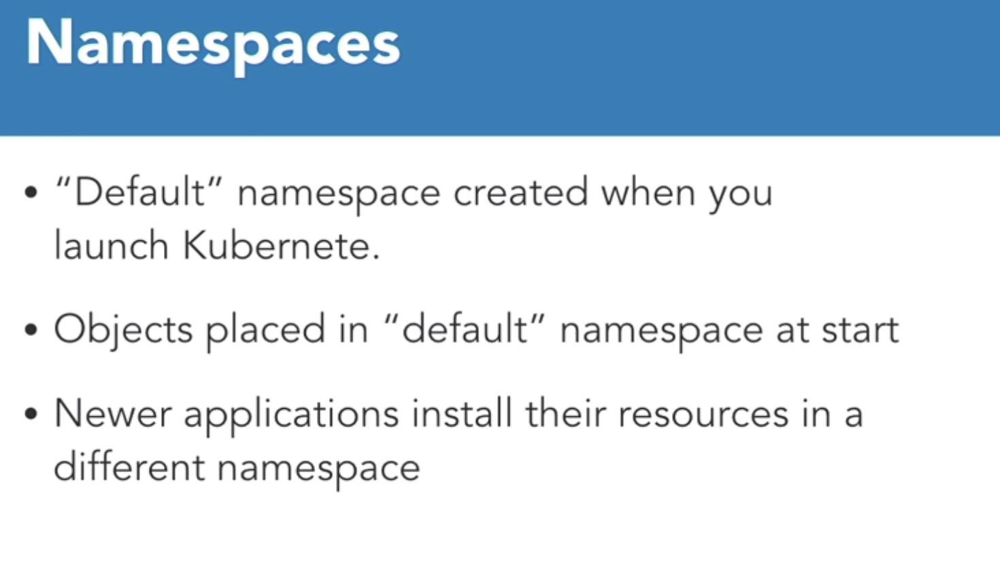

# Labels, selectors, namespaces
The last must know concept to build applications are labels, selectors, and namespaces. These constructs allow us to agitate and organize our applications so that when we have a lot of them.
## Labels


> Labels are key value pairs that are attached to objects like pods, services, and deployments. Labels are for us, the users of Kubernetes, to identify attributes for objects.

Typically, labels are used to organize clusters in some meaningful way. They can be added at deployment time, or later on and changed at any time.

Label keys are unique per object. Here are some examples of labels we might use.
```
"release": "stable", "release": "canary"
"environment": "dev", "environment": "production"
"tier":"frontend", "tier":"backend","tier":"cache"
```
We might have a release label that has stable or canary deploys. We could have environment labels that specify the environment, such as dev, qa, production, etc, or perhaps tier labels to signify that something is a front end or a back end tier. 
As you can tell, labels are very specific to your use case, and they are built for users, so think about what your environment looks like, and how you want to organize your applications, and then get your label maker out.
## Selectors
By themselves, labels aren't really that powerful. But when you add selectors, you introduce a very powerful feature. With labels and selectors, you can identify a specific set of objects.
There are two kinds of selectors, equality-based and set-based.

1. **Equality-based selectors** include the equals and not equals, where the equals represents equality, where two labels or values of labels should be equal. Not equal represents inequality. This means that the values of the labels should not be equal.
2. **Set-based selectors** that include IN, NOTIN, and EXISTS operators.
1. The IN operator specifies that the value should be in a set of defined values.
2. The NOTIN operators specified that the value should not be in a set of defined values. 
3. And finally, the EXISTS operator is used to determine whether a label exists or not.
Labels and label selectors are typically used with a kubectl command to list and filter objects.

## Name Spaces
Unlike labels and selectors, the namespace concept is a feature of Kubernetes that allows you to have multiple virtual clusters backed by the same physical cluster.


1. Namespaces are a great concept to use for large enterprises where there are many users and teams and you want to give access to different teams but at the same time have a rough idea of who owns what in the Kubernetes environment. For example, if you have a big e commerce company, you might have a namespace for your catalog team, card team and order status team to run their different applications.
2. It's also a great way to divide cluster resources between multiple users and this can be done using resource quotas. 
3. Namespaces provide scope for names. Names of resources, like deployments and pods, must be unique within the namespace, but not necessarily across separate namespaces. So in our example, the catalog team and the card team can have an application name authentication in their own namespaces. When you launch Kubernetes, there is a default namespace where all our objects get placed, but you are allowed to create new namespaces as and when you wish.
Also you'll notice that when you install newer application Kubernetes, they'll typically instal a brand new namespace, so that they don't interfere with your existing cluster and cause confusion.
